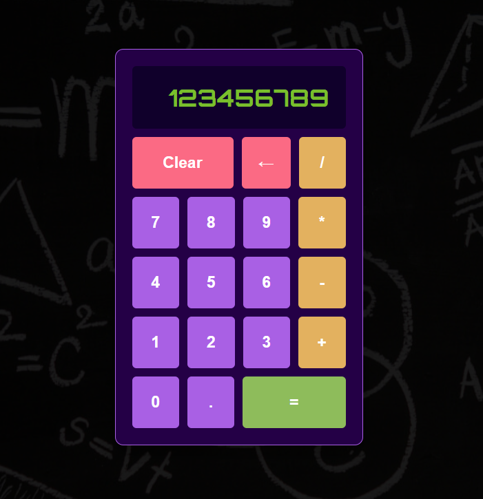

# Calculator Project

## Description  
A browser-based version of the calculator.

## 👉 [Live Preview](https://woodheadbear.github.io/calculator/)

## Features  
- Mouse and Keyboard input  
- Display capacity up to 9 digits  
- Reset and Backspace functionality
- Can't divide by zero but you have to try 😉

## Preview  


## Tech Stack  
- HTML  
- CSS  
- JavaScript  

## Installation  
Clone the repository and open `index.html` in your browser.

```bash
git clone <your-repo-url>
cd <your-repo-folder>
open index.html